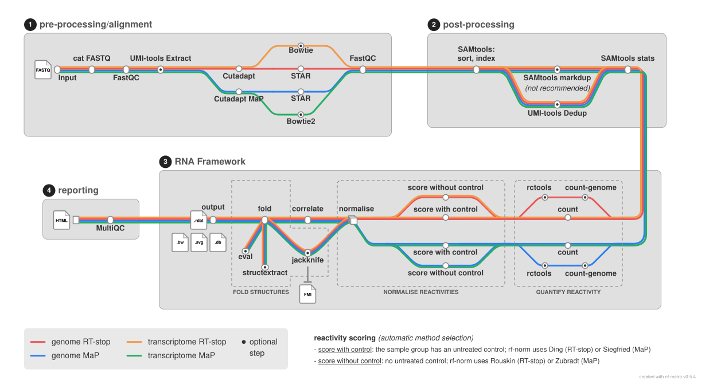

<h1>
  <picture>
    <source media="(prefers-color-scheme: dark)" srcset="docs/images/nf-core-rnastructurome_logo_dark.png">
    
  </picture>
</h1>

[](https://github.com/codespaces/new/nf-core/rnastructurome)
[](https://github.com/nf-core/rnastructurome/actions/workflows/nf-test.yml)
[](https://github.com/nf-core/rnastructurome/actions/workflows/linting.yml)[](https://nf-co.re/rnastructurome/results)
[](https://www.nf-test.com)

[](https://www.nextflow.io/)
[](https://github.com/nf-core/tools/releases/tag/4.1.0)
[](https://docs.conda.io/en/latest/)
[](https://www.docker.com/)
[](https://sylabs.io/docs/)
[](https://cloud.seqera.io/launch?pipeline=https://github.com/nf-core/rnastructurome)

[](https://nfcore.slack.com/channels/rnastructurome)[](https://bsky.app/profile/nf-co.re)[](https://mstdn.science/@nf_core)[](https://www.youtube.com/c/nf-core)

## Introduction

**nf-core/rnastructurome** is a bioinformatics pipeline for analysing chemical high-throughput RNA structure-probing data. It takes a samplesheet and FASTQ files from **SHAPE** or **DMS** experiments (read out by either the **RT-stop** or **mutational profiling (MaP)** principle) then performs quality control, trimming and alignment, quantifies per-base reactivity, and predicts RNA secondary structures. Outputs include normalised reactivity, Shannon entropy and base-pair arc tracks, 2D structure diagrams, RMDB-compatible RDAT files, and an aggregated QC report. References can be supplied locally or fetched automatically from Ensembl or NCBI, so the pipeline works across a wide range of organisms, including viruses and bacteria.

<p align="center">
    <picture>
        <source media="(prefers-reduced-motion: reduce)" srcset="docs/images/nf-metro-light.svg">
        
    </picture>
</p>

Pipeline steps:

1. Merge re-sequenced FASTQ files (`cat/fastq`)
2. Raw read QC ([`FastQC`](https://www.bioinformatics.babraham.ac.uk/projects/fastqc/))
3. Optional UMI extraction ([`UMI-tools extract`](https://umi-tools.readthedocs.io/)) when `umi_pattern` is supplied
4. Adapter and quality trimming ([`Cutadapt`](https://cutadapt.readthedocs.io/)) with principle-aware settings, followed by post-trim FastQC
5. Reference resolution: use local FASTA/GTF inputs, download genome FASTA and GTF from Ensembl, or fall back to NCBI for organisms not captured by Ensembl such as bacteria and viruses
6. Reference indexing: [`STAR`](https://github.com/alexdobin/STAR) genome index by default; optional [`Bowtie`](http://bowtie-bio.sourceforge.net/) / [`Bowtie2`](http://bowtie-bio.sourceforge.net/bowtie2/) transcriptome indexes with `--transcriptome`
7. Alignment: STAR for the default genome route; Bowtie for RT-stop and Bowtie2 for MaP on the optional transcriptome route
8. BAM sorting, indexing, and alignment QC ([`SAMtools`](https://www.htslib.org/))
9. Duplicate handling: UMI-aware deduplication ([`UMI-tools dedup`](https://umi-tools.readthedocs.io/)) for libraries with a `umi_pattern`. Position-based duplicate removal ([`SAMtools markdup`](https://www.htslib.org/)) is **disabled by default** (`skip_markdup = true`) and is not recommended for chemical-probing data without UMIs, where reads sharing a 5' start are independent molecules rather than PCR duplicates; enable it with `--skip_markdup false` only if you have a specific reason
10. Per-base reactivity counting: by default, [`rf-count`](https://rnaframework-docs.readthedocs.io/en/latest/rf-count/) tallies mutations (MaP) or RT-stops (RT-stop) directly on transcript-coordinate alignments - the genome route runs it on STAR's `--quantMode TranscriptomeSAM` output, the transcriptome route on the transcript BAM. Alternatively, on the genome route with `--count_genome`, [`rf-count-genome`](https://rnaframework-docs.readthedocs.io/en/latest/rf-count-genome/) counts against genome coordinates - with strandedness resolved first (GTF-to-BED conversion via [`BEDOPS`](https://bedops.readthedocs.io/) and, for MaP libraries, strand inference via [`RSeQC infer_experiment`](https://rseqc.sourceforge.net/)) - followed by [`rf-rctools extract`](https://rnaframework-docs.readthedocs.io/en/latest/rf-rctools/) to pull per-transcript reactivity
11. Reactivity normalisation with automatic control pairing and scoring-method selection ([`rf-norm`](https://rnaframework-docs.readthedocs.io/en/latest/rf-norm/))
12. Reactivity track generation from rf-norm outputs, including transcript-coordinate and genome-coordinate WIG/BigWig files ([`rf-wiggle`](https://rnaframework-docs.readthedocs.io/en/latest/rf-wiggle/))
13. Replicate reproducibility QC: pairwise Pearson and Spearman correlation of per-`sample_group` reactivity profiles ([`rf-correlate`](https://rnaframework-docs.readthedocs.io/en/latest/rf-correlate/)), summarised in the MultiQC report
14. Optional normalisation calibration against reference structures ([`rf-jackknife`](https://rnaframework-docs.readthedocs.io/en/latest/rf-jackknife/)) when `--jackknife_reference` is provided; with `--stop_after_jackknife` the pipeline ends here, emitting the FMI (Fowlkes-Mallows Index) calibration table as its final output
15. RNA secondary structure prediction across grouped replicates ([`rf-fold`](https://rnaframework-docs.readthedocs.io/en/latest/rf-fold/))
16. Base-pair and Shannon entropy track generation from rf-fold outputs, including transcript-coordinate and genome-coordinate files where possible
17. 2D structure diagram drawing: every structure is drawn with [`ViennaRNA`](https://www.tbi.univie.ac.at/RNA/) RNAplot; when a model for a determined RNA type exists, [`R2DT`](https://github.com/RNAcentral/R2DT) template-matched diagrams are drawn in parallel for side-by-side comparison (`structures/viennarna/` vs `structures/r2dt/`). R2DT is container-only, so conda/mamba runs draw with ViennaRNA alone
18. RDAT export combining per-transcript reactivity and structure ([`rnaframework_to_rdat`](bin/rnaframework_to_rdat.py))
19. Optional downstream analysis of the folded structures: structural-element extraction of high-confidence, low-reactivity/low-Shannon motifs ([`rf-structextract`](https://rnaframework-docs.readthedocs.io/en/latest/rf-structextract/), enabled with `--structextract`) and structure-accuracy evaluation against known structures ([`rf-eval`](https://rnaframework-docs.readthedocs.io/en/latest/rf-eval/), enabled by `--rfeval_reference`)
20. Aggregated QC report ([`MultiQC`](http://multiqc.info/))

## Usage

> [!NOTE]
> If you are new to Nextflow and nf-core, please refer to [this page](https://nf-co.re/docs/get_started/environment_setup/overview) on how to set-up Nextflow. Make sure to [test your setup](https://nf-co.re/docs/get_started/run-your-first-pipeline) with `-profile test` before running the workflow on actual data.

The pipeline supports two chemical probing chemistries and two readout principles. These drive automatic parameter selection throughout the pipeline and should be set per sample in the samplesheet or globally via `--method` and `--principle`. Both are case-insensitive.

First, prepare a samplesheet with your input data:

`samplesheet.csv`:

```csv
sample,sample_id,fastq_1,fastq_2,method,principle,chemical,RT_enzyme,sample_group,condition,replicate,organism,pH,adapter_3p,adapter_5p,umi_pattern
HEK293T_treated_r1,GSM000001,/data/treated_r1.fastq.gz,,SHAPE,RT-stop,NAI,M-MLV,HEK293T,treated,1,Homo sapiens,7.5,,,
HEK293T_untreated_r1,GSM000002,/data/untreated_r1.fastq.gz,,SHAPE,RT-stop,NAI,M-MLV,HEK293T,untreated,1,Homo sapiens,7.5,,,
```

Each row is one sample. The columns `sample`, `fastq_1`, `sample_group`, `condition`, and `replicate` are always required (`sample_group`, `condition`, and `replicate` pair treated/untreated/denatured controls for `rf-norm`; supported `condition` values are `treated`, `untreated`, `denatured`). `method`, `principle`, and `organism` are required information but may instead be given globally via `--method`, `--principle`, and `--organism` when they are uniform across samples. Every other column (`sample_id`, `fastq_2`, `chemical`, `RT_enzyme`, `pH`, `adapter_3p`, `adapter_5p`, `umi_pattern`) is optional and falls back to its global `--<param>` value or a sensible default when left blank. See the [usage documentation](https://nf-co.re/rnastructurome/usage) for the full column reference.

Rows with the same sample identifier are considered technical replicates and merged automatically. Samples are grouped by `sample_group` and replicate so that treated, untreated, and denatured controls are paired correctly for normalisation.

Now run the pipeline. By default no reference is supplied, so the pipeline downloads the genome FASTA and GTF for each sample's `organism` from Ensembl (or NCBI for bacteria/viruses) and aligns with STAR (genome route):

```bash
nextflow run nf-core/rnastructurome \
   -profile <docker/singularity/.../institute> \
   --input samplesheet.csv \
   --outdir <OUTDIR>
```

Alternatively, provide your own reference. Supplying `--fasta` (with `--gtf` for the genome route) takes priority over any `organism` download:

```bash
nextflow run nf-core/rnastructurome \
   -profile <docker/singularity/.../institute> \
   --input samplesheet.csv \
   --fasta genome.fa \
   --gtf annotation.gtf.gz \
   --outdir <OUTDIR>
```

To align against a transcript-level FASTA with Bowtie/Bowtie2 instead of a genome, add `--transcriptome true` and pass the transcript FASTA as `--fasta` (the GTF is optional on this route):

```bash
nextflow run nf-core/rnastructurome \
   -profile <docker/singularity/.../institute> \
   --input samplesheet.csv \
   --fasta transcripts.fa \
   --transcriptome true \
   --outdir <OUTDIR>
```

> [!WARNING]
> Please provide pipeline parameters via the CLI or Nextflow `-params-file` option. Custom config files including those provided by the `-c` Nextflow option can be used to provide any configuration _**except for parameters**_; see [docs](https://nf-co.re/docs/running/run-pipelines#using-parameter-files).

For more details and further functionality, please refer to the [usage documentation](https://nf-co.re/rnastructurome/usage) and the [parameter documentation](https://nf-co.re/rnastructurome/parameters).

## Pipeline output

To see the results of an example test run with a full size dataset refer to the [results](https://nf-co.re/rnastructurome/results) tab on the nf-core website pipeline page.
For more details about the output files and reports, please refer to the
[output documentation](https://nf-co.re/rnastructurome/output).

This pipeline quantifies per-base reactivity and predicts secondary structures for the transcripts in your reference, grouping replicates and pairing treated/untreated controls for normalisation. It does not statistically compare conditions or samples. The per-nucleotide reactivity tracks, Shannon-entropy and base-pair-arc tracks, 2D structure diagrams, and RMDB-compatible RDAT files are intended for genome-browser visualisation, structural analysis, and deposition, and can be taken into downstream tools for cross-condition comparison.

## Credits

nf-core/rnastructurome was originally written by Victoria Begley (@Vicbeg) and Pedro Madrigal (@pmb59) from RNAcentral (EBI-EMBL).

We thank the following people for their extensive assistance in the development of this pipeline:

- Danny Incarnato
- Yiliang Ding

## Contributions and Support

If you would like to contribute to this pipeline, please see the [contributing guidelines](docs/CONTRIBUTING.md).

For further information or help, don't hesitate to get in touch on the [Slack `#rnastructurome` channel](https://nfcore.slack.com/channels/rnastructurome) (you can join with [this invite](https://nf-co.re/join/slack)).

## Citations

An extensive list of references for the tools used by the pipeline can be found in the [`CITATIONS.md`](CITATIONS.md) file.

You can cite the `nf-core` publication as follows:

> **The nf-core framework for community-curated bioinformatics pipelines.**
>
> Philip Ewels, Alexander Peltzer, Sven Fillinger, Harshil Patel, Johannes Alneberg, Andreas Wilm, Maxime Ulysse Garcia, Paolo Di Tommaso & Sven Nahnsen.
>
> _Nat Biotechnol._ 2020 Feb 13. doi: [10.1038/s41587-020-0439-x](https://dx.doi.org/10.1038/s41587-020-0439-x).
