# nf-core/rnastructurome: Output

## Introduction

This document describes the output produced by the pipeline. Most of the early steps (QC, trimming, alignment) follow standard RNA-seq conventions and their outputs are described in the [nf-core/rnaseq](https://nf-co.re/rnaseq/3.14.0/docs/output/) documentation; this page focuses on the RNA Framework modules and downstream outputs specific to this pipeline.

## Output layout

All paths are relative to the top-level output directory specified with `--outdir`.

```text
<outdir>/
├── fastqc/                            (raw and post-trimming reads)
├── cat/                               (if multi-lane FASTQ merging occurs)
├── cutadapt/
├── star/
├── bowtie/                            (if --transcriptome)
├── samtools/
├── umi_tools/                         (if UMI pattern provided)
├── reference/
│   ├── *.sorted.fa                   (Ensembl download only)
│   ├── *.annotation.gtf.gz           (Ensembl download only)
│   ├── *.transcripts.fa              (genome route, count_genome=false: transcript FASTA for browser viewing)
│   ├── ensembl_fasta_source_url.txt
│   └── ensembl_gtf_source_url.txt
├── count/
│   ├── rfcount_summary_all_samples.tsv
│   └── <sample>/*.{rc,rci}
├── norm/
│   ├── <reference>.norm_factors.txt      (if cross-experiment normalisation enabled)
│   ├── <reference>.rfnormfactor.log
│   ├── <group>_<replicate>/
│   │   ├── xml/*.xml
│   │   ├── wiggle/<group>.wig
│   │   └── rfnorm.log
│   ├── genome_bw/*.bw
│   └── transcript_bw/*.bw
├── correlate/                         (if --correlate_replicates and >1 replicate)
│   ├── <group>.{pearson,spearman}.rfcorrelate.log
│   └── <group>.{pearson,spearman}_correlate/
│       ├── matrix.csv
│       └── pairwise/*.tsv
├── fold/
│   ├── <group>/
│   │   ├── structures/r2dt/*.svg
│   │   ├── structures/viennarna/*.svg
│   │   ├── rdat/*.rdat
│   │   ├── rffold.log
│   │   └── extracted_structures/      (if --structextract)
│   │       ├── dotbracket/*.db        (extracted motifs, dot-bracket)
│   │       └── images/*_ss.svg        (per-motif diagrams, reactivity-coloured)
│   ├── genome_bp/*.bp
│   ├── transcript_bp/*.bp
│   ├── shannon_genome_bw/*.bw
│   └── shannon_transcript_bw/*.bw
├── jackknife/                         (if --jackknife_reference provided)
│   └── all_groups_jackknife/          (or <group>_jackknife/ per group if --rfjackknife_pool_all false)
│       ├── mFMI.csv
│       └── rfjackknife.log
├── eval/                              (if --rfeval_reference provided)
│   └── <group>_rfeval/
│       └── rfeval.log
├── multiqc/
└── pipeline_info/
```

## Standard steps (QC, trimming, alignment)

Read QC (FastQC), adapter trimming (Cutadapt), alignment (STAR), and SAMtools post-processing follow standard nf-core/rnaseq conventions. See the [nf-core/rnaseq output documentation](https://nf-co.re/rnaseq/3.14.0/docs/output/) for a description of those output files.

FastQC is run twice per sample and both reports are published to `fastqc/`: once on the raw input reads (`<sample>_{1,2}_fastqc.*`) and once on the Cutadapt-trimmed reads (`<sample>_trimmed_trimmed_{1,2}_fastqc.*`), so you can compare read quality before and after trimming.

## Reference files

<details markdown="1">
<summary>Output files</summary>

- `reference/`
  - `ensembl_fasta_source_url.txt`: URL of the FASTA file downloaded from Ensembl, for provenance.
  - `ensembl_gtf_source_url.txt`: URL of the GTF file downloaded from Ensembl, for provenance.
  - `<organism>.sorted.fa`: Chromosome-sorted reference FASTA, ready for reuse in subsequent runs via `--fasta`.
  - `<organism>.annotation.gtf.gz`: Ensembl gene annotation GTF, ready for reuse via `--gtf`.
  - `<reference>.transcripts.fa`: Genome route with the default `count_genome = false` only. Transcript sequences extracted from the genome FASTA and GTF (via `gffread`), matching the transcript IDs used in the count/norm/fold outputs. Load this as the reference in a genome browser to view the transcript-coordinate tracks (see below).

</details>

The source-URL and `sorted.fa` / `annotation.gtf.gz` files are published only when the reference is downloaded automatically from Ensembl (i.e. `--fasta` was not provided); when a local FASTA is supplied, those are not re-published. The sorted FASTA can be passed directly to subsequent runs to skip the download step. The `transcripts.fa` file is published whenever the genome route runs (regardless of reference source), because the genome route otherwise has no single transcript FASTA to view the transcript-coordinate tracks against.

## RNA Framework

This pipeline uses modules from [RNA Framework](https://rnaframework-docs.readthedocs.io/en/latest/).

### rf-count

<details markdown="1">
<summary>Output files: transcriptome route</summary>

- `count/rfcount_summary_all_samples.tsv`: Aggregated `rf-count` summary across all samples in the run (the per-sample summaries are merged into this single TSV for easy comparison between samples).
- `count/<sample>/`
  - `<sample>.rc`: Transcript-level raw per-position count file used as input to `rf-norm`.
  - `index.rci`: Index sidecar for the transcript-level count file.

</details>

<details markdown="1">
<summary>Output files: genome route</summary>

- `count/<sample>/`
  - `<sample>.plus.rc` / `<sample>.minus.rc`: Genome-coordinate strand-specific raw count files.
  - `<sample>.rc`: Transcript-level count file extracted from genome coordinates via `rf-rctools extract`, used as input to `rf-norm`.
  - `<sample>.rc.rci`: Index sidecar for the transcript-level count file.
  - The aggregated `count/rfcount_summary_all_samples.tsv` (above) also covers genome-route samples.

</details>

[`rf-count`](https://rnaframework-docs.readthedocs.io/en/latest/rf-count/) calculates per-base RT-stop or mutation counts and read coverage from aligned reads. In most cases, the pipeline runs `rf-count` directly against transcript-coordinate BAM files provided by STAR or Bowtie. Optionally, it runs [`rf-count-genome`](https://rnaframework-docs.readthedocs.io/en/latest/rf-count-genome/) on the genome aligned BAM first, then converts genome-coordinate count files to transcript-level `.rc` files with `rf-rctools extract`.

The transcript-level `<sample>.rc` and `<sample>.rc.rci` files are passed to `rf-norm` for reactivity normalisation.

#### Example `rfcount_summary_all_samples.tsv`

The aggregated summary reports, per sample, the number of transcripts `covered` and the per-base composition of the counted events (`pct_a_muts`…`pct_u_muts`). The exact column set depends on the counting mode: MaP counts mismatches within each alignment, so it can report the overall mutated-alignment fraction (`mutated_alignments`, `pct_mutated`); RT-stop counts reverse-transcriptase drop-off positions rather than per-read mutations, so those two columns do not apply and are omitted. As a sanity check on the chemistry, in MaP runs `pct_mutated` should be higher in the treated samples than in the untreated controls. For DMS specifically (at pH < 8, where it modifies mainly A and C), `pct_a_muts` and `pct_c_muts` should dominate over `pct_g_muts` and `pct_u_muts`.

**MaP (mutational profiling) (SHAPE)**

| sample                       | covered | mutated_alignments   | pct_mutated | pct_a_muts | pct_c_muts | pct_g_muts | pct_u_muts |
| ---------------------------- | ------- | -------------------- | ----------- | ---------- | ---------- | ---------- | ---------- |
| MDA-MB-231_DMSO_treated_r1   | 20241   | 106400534/151175161  | 70.38       | 19.59      | 21.41      | 26.94      | 32.06      |
| MDA-MB-231_DMSO_treated_r2   | 20508   | 109647170/159460915  | 68.76       | 19.83      | 20.65      | 27.11      | 32.42      |
| MDA-MB-231_DMSO_untreated_r1 | 24171   | 294831112/1121966212 | 26.28       | 20.30      | 29.69      | 28.89      | 21.11      |
| MDA-MB-231_DMSO_untreated_r2 | 24482   | 351733856/1409123432 | 24.96       | 20.84      | 25.96      | 30.87      | 22.33      |
| MDA-MB-231_MTX_treated_r1    | 20639   | 121944486/180812092  | 67.44       | 20.05      | 21.29      | 25.81      | 32.84      |
| MDA-MB-231_MTX_treated_r2    | 20473   | 108016250/155999073  | 69.24       | 20.27      | 20.68      | 26.33      | 32.71      |

This is close to an ideal result: the treated samples sit at ~67-70% `pct_mutated` against ~25% in the untreated controls, a clean ~3× separation that shows the probe reacted well above background.

**RT-stop (DMS)**

| sample                      | covered | pct_a_muts | pct_c_muts | pct_g_muts | pct_u_muts |
| --------------------------- | ------- | ---------- | ---------- | ---------- | ---------- |
| L26_Delta_Rep1_100mM_DMS_r1 | 4278    | 48.48      | 12.43      | 17.03      | 22.06      |
| L26_Delta_Rep1_100mM_DMS_r2 | 4734    | 39.09      | 15.35      | 21.21      | 24.36      |
| L26_Delta_Rep1_NoDMS_r1     | 4369    | 32.74      | 15.94      | 20.74      | 30.58      |
| L26_Delta_Rep1_NoDMS_r2     | 5016    | 26.71      | 18.95      | 24.30      | 30.03      |
| Scer_WT_NoDMS_r1            | 4117    | 31.88      | 16.59      | 21.51      | 30.02      |
| Scer_WT_NoDMS_r2            | 5038    | 26.31      | 18.98      | 24.63      | 30.07      |
| WT_Rep1_100mM_DMS_r1        | 4223    | 47.23      | 12.81      | 18.34      | 21.62      |
| WT_Rep1_100mM_DMS_r2        | 4584    | 39.38      | 15.08      | 20.99      | 24.56      |

This example is less clear-cut. Lacking `pct_mutated` (see above), the base composition is the main handle: `pct_a_muts` does rise in the DMS-treated samples (~39-48% vs ~26-32% in the controls), but `pct_c_muts` is not elevated as DMS at pH < 8 would predict. Results like this warrant a closer look at the downstream reactivities before drawing conclusions.

### rf-normfactor (optional)

<details markdown="1">
<summary>Output files</summary>

- `norm/<reference>.norm_factors.txt`: Transcriptome-wide, cross-experiment normalisation factors for the reference, applied to every group's `rf-norm` via `-nf`.
- `norm/<reference>.rfnormfactor.log`: Raw `rf-normfactor` console output.

</details>

[`rf-normfactor`](https://rnaframework-docs.readthedocs.io/en/latest/rf-normfactor/) derives a single set of normalisation factors across all samples in a dataset aligned to the same reference so that reactivities are on a common scale for cross-sample comparison. This is auto-enabled for a reference with more than one treated sample. When it does not run, `rf-norm` normalises each group independently and no factor file is produced.

#### Example `<reference>.rfnormfactor.log`

The log records how many bases were covered across all of the reference's samples, how many of those were selected for normalisation, and the resulting per-sample factor that is passed to each treated group's `rf-norm` via `-nf`. Only treated samples receive a factor; untreated controls contribute to scoring but are not listed here.

```text
[+] Loading RC files...
[+] Calculating raw reactivities for bases covered across all samples... 810287 bases selected.
[+] Freeing unused memory...
[+] Selecting bases for normalization... 10700 selected.
[+] Normalization factors:

  [*] MDA-MB-231_DMSO_treated_r1: 0.0303267245741193
  [*] MDA-MB-231_DMSO_treated_r2: 0.0307702477985242
  [*] MDA-MB-231_MTX_treated_r1: 0.0274075148970783
  [*] MDA-MB-231_MTX_treated_r2: 0.0315441960095623

[+] All done.
```

The factors within a reference should be broadly comparable across samples; a sample with a wildly different factor is worth investigating.

### rf-norm

<details markdown="1">
<summary>Output files</summary>

- `norm/<group>/`
  - `xml/<transcript>.xml`: Normalised reactivity profiles in RNA Framework XML format, used as input for `rf-fold` and optionally `rf-jackknife`.
  - `rfnorm.log`: Raw `rf-norm` console output.
  - `wiggle/<group>.wig`: Reactivity wiggle track for the group, produced by `rf-wiggle` over all of the group's normalised transcript XMLs. This is a single WIG file with one section per transcript (not one file per transcript).
- `norm/genome_bw/`
  - `<sample_group>_reactivity_genome.bw`: Genomic-coordinate reactivity BigWig. When multiple replicates are present the per-replicate transcript-level tracks are averaged position-by-position, remapped to genomic coordinates using the GTF, and converted to BigWig format.
- `norm/transcript_bw/`
  - `<sample_group>_reactivity_transcript.bw`: Transcript-coordinate reactivity BigWig. Same averaged reactivity data as `genome_bw/` but in transcript coordinates, suitable for visualisation alongside transcript-level annotations.

</details>

[`rf-norm`](https://rnaframework-docs.readthedocs.io/en/latest/rf-norm/) normalises raw RT-stop or MaP counts into per-nucleotide reactivity scores. Reactivity reflects each nucleotide's accessibility to the probe: high reactivity indicates an unpaired, flexible base, while low reactivity indicates a paired or structurally protected one. Output is grouped by `sample_group` + `replicate` (e.g. `HEK293T_1`). The XML files are the primary output passed to downstream structure-prediction steps. The BigWigs provide reactivity tracks (averaged across replicates where applicable) in both genomic and transcript coordinates for genome browser visualisation.

#### Example `rfnorm.log`

This log summarises how many transcripts were normalised and why others were dropped:

```text
[+] Normalization statistics:

  [*] Covered transcripts:   2264
  [*] Discarded transcripts: 30203 total
                             30203 insufficient coverage
                             0 mismatch between treated and untreated sample sequence
                             0 absent in untreated sample reference

[+] All done.
```

Most transcripts are typically discarded for insufficient coverage; the mismatch and absent-in-untreated counts should stay at or near zero, as non-zero values there point to a reference or sample-pairing problem rather than shallow coverage.

The reactivity BigWigs (`norm/{genome,transcript}_bw/`) can be loaded into a genome browser such as IGV; see [Viewing tracks in a genome browser](#viewing-tracks-in-a-genome-browser) for which reference to load per route, example figures, and interpretation caveats.

### rf-correlate (replicate QC)

<details markdown="1">
<summary>Output files</summary>

- `correlate/<group>.pearson_correlate/` and `correlate/<group>.spearman_correlate/`
  - `matrix.csv`: Overall pairwise correlation matrix between the group's replicates.
  - `pairwise/<repA>_vs_<repB>.tsv`: Per-transcript correlation coefficients and p-values for each replicate pair.
- `correlate/<group>.{pearson,spearman}.rfcorrelate.log`: Raw `rf-correlate` console output for each method.

</details>

[`rf-correlate`](https://rnaframework-docs.readthedocs.io/en/latest/rf-correlate/) quantifies replicate reproducibility by correlating reactivity profiles between the replicates of a sample group (transcriptome-wide and per-transcript). It runs for groups with more than one replicate (controlled by `--correlate_replicates`) and computes both **Pearson** (reactivity-capped) and **Spearman** (rank-based) correlations, published to separate `.pearson`/`.spearman` directories. The overall pairwise correlations are also summarised in the MultiQC report as a per-sample-group table (number of replicates, mean Pearson and mean Spearman correlation), giving an at-a-glance reproducibility check.

#### Example `rfcorrelate.log`

Each log reports how many transcripts were shared across the group's replicates, the pairwise correlation, and how many transcripts had enough paired positions to be correlated:

```text
[+] Importing input XML directories/files... 2144 common transcripts.
[+] Calculating pairwise correlations...

[+] Pairwise correlations (over 855878 bases):

  Sample #1    Sample #2    Correlation    p-value

  rep1_1       rep2_2       0.765          0.00e+00

[+] Correlation statistics:

  [*] Correlated transcripts/blocks: 2141
  [*] Discarded transcripts/blocks:  3 total
                                     0 parsing failed
                                     0 mismatch between transcript sequences
                                     3 not enough values for correlation calculation

[+] All done.
```

The headline number is the pairwise correlation (here Pearson 0.765 between the two DMSO replicates); higher means more reproducible reactivity profiles, and it is the value carried into the MultiQC table. Discards are almost always transcripts with too few paired positions to correlate; non-zero `parsing failed` or `mismatch between transcript sequences` counts instead indicate a reference or input problem.

### rf-fold

<details markdown="1">
<summary>Output files</summary>

- `fold/<group>/`
  - `structures/r2dt/<transcript>.svg`: Template-based 2D structure diagram drawn by R2DT, when a matching template is available.
  - `structures/viennarna/<transcript>.svg`: RNAplot 2D structure diagram drawn by ViennaRNA.
  - `structures/r2dt.log`: log of transcripts drawn/skipped by R2DT.
  - `rdat/<transcript>.rdat`: RDAT-format file (compatible with RMDB) which summarises results (sequence, dot-bracket notation, reactivities) and key parameters for how it was produced.
  - `rffold.log`: Raw `rf-fold` console output.
- `fold/genome_bp/`
  - `<sample_group>_genome.bp`: Base-pair arcs merged into a single file per sample group in genome coordinates, suitable for arc diagram visualisation in a genome browser such as IGV.
- `fold/transcript_bp/`
  - `<sample_group>_transcript.bp`: Same base-pair arcs in transcript coordinates (transcript ID as chromosome, 1-based transcript positions). Suitable for visualisation against a transcript-level reference in IGV.
- `fold/shannon_genome_bw/`
  - `<sample_group>_shannon_genome.bw`: Genomic-coordinate per-position Shannon entropy BigWig across the transcript ensemble for a sample group.
- `fold/shannon_transcript_bw/`
  - `<sample_group>_shannon_transcript.bw`: Transcript-coordinate Shannon entropy BigWig, equivalent to `shannon_genome_bw/` but in transcript coordinates.

</details>

[`rf-fold`](https://rnaframework-docs.readthedocs.io/en/latest/rf-fold/) predicts RNA secondary structures from normalised reactivity profiles. Replicates for the same sample group are combined and folded together using ViennaRNA RNAfold in a windowed manner, which improves accuracy for long transcripts by folding overlapping sequence windows and merging the results. Key outputs per transcript include 2D structure diagrams, [RDAT](https://rmdb.stanford.edu/deposit/specs/) files summarising the predicted structure and reactivity values. Genome-wide Shannon entropy profiles and base-pair arcs are additionally provided as BigWig and `.bp` tracks for visualisation in a genome browser, in both genome and transcript coordinates. Shannon entropy measures the uncertainty of the predicted base-pairing at each position: lower entropy means the structure ensemble agrees on a single conformation (a higher-confidence prediction), while higher entropy indicates several competing folds.

The two renderers run independently in parallel, so a transcript with an R2DT template gets both diagrams:

- **[ViennaRNA](https://www.tbi.univie.ac.at/RNA/)**: draws every transcript. `RNAplot` produces an energy-minimised 2D diagram from the dot-bracket structure. Published to `fold/<group>/structures/viennarna/`.
- **[R2DT](https://github.com/RNAcentral/R2DT)**: additionally draws transcripts with a matching template in the R2DT library (rRNA, snRNA, tRNA, etc.), producing layouts comparable across organisms. Enabled with `--r2dt`. Published to `fold/<group>/structures/r2dt/`.

#### Example structure diagram

R2DT lays the predicted structure onto a standard template so diagrams are comparable across samples and organisms. The example below is the _E. coli_ 16S rRNA (`fold/E_coli_DH5a_ex_vivo/structures/r2dt/16S.svg`), matched to the R2DT small-subunit rRNA template:

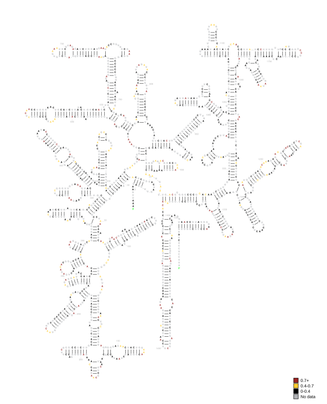

ViennaRNA `RNAplot` draws the same predicted structure with an energy-minimised layout rather than a standard template. Because both renderers run, a transcript like 16S is drawn both ways: here is the same _E. coli_ 16S rRNA drawn by ViennaRNA (`fold/E_coli_DH5a_ex_vivo/structures/viennarna/16S.svg`):

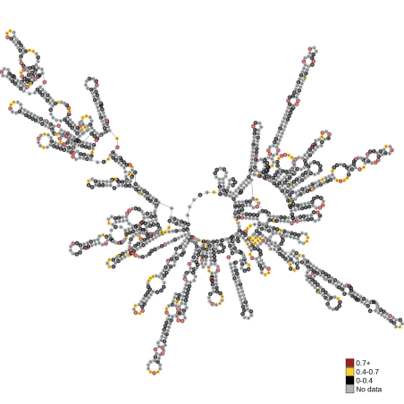

#### Example `.rdat` file

The per-transcript RDAT file bundles the sequence, the predicted structure, and the reactivity data behind these diagrams into one [RMDB-compatible](https://rmdb.stanford.edu/deposit/specs/) record. Below is the _E. coli_ 16S rRNA RDAT with the long sequence/structure/reactivity lines abbreviated:

```text
NAME	16S rRNA
SEQUENCE	AAAUUGAAGAGUUUGAUCAUGGCUCAGAUUGAACGCUGGCGGCAGGCCUAACACAUGCAAGUCGAACGGUAACAGGAAGAAGCUUGCUUCUUUGCUGACG…
STRUCTURE	........(((((.......)))))......((((((.(((((((((((..(((.(((..(((....(((((..(((((.......))))))))))))).…
ANNOTATION_DATA:1	modifier:DMS
REACTIVITY	0 0 0 NaN NaN NaN 0.053 0.065 NaN 0.012 NaN NaN NaN NaN NaN 0.024 NaN 0.05 0.252 NaN NaN NaN 0.01 NaN 0.089 0.482 NaN 0.057 NaN NaN NaN 0.044 0.041 0.019 NaN 0.022 NaN NaN NaN 0.021 NaN NaN 0.023 0.235 NaN NaN 0.024 0.078 NaN 0.562 0.869 0.154 0.122 0.108 0.352 NaN NaN 0.055 0.857 0.44 NaN NaN 0.037 NaN 0.927 0.759 2.555 NaN NaN NaN 0.2 0.224 0.026 0.064 NaN NaN 0.021 0.036 NaN 2.938 0.034 NaN 0.073 NaN NaN NaN 0.008 NaN NaN 0.022 NaN NaN NaN NaN 0.045 NaN NaN 0.115 0.068 …
COMMENT	Generated by nf-core/rnastructurome v1.0.0dev; FASTA: ecoli_rrna_collab.fa; Principle: MaP; rf-norm scoring: sm=4 (Zubradt); normalisation: nm=3 (Box-plot)
```

The fields are: `NAME` (transcript ID), `SEQUENCE`, `STRUCTURE` (predicted structure in dot-bracket notation), `ANNOTATION_DATA` (the probe used, here DMS), `REACTIVITY` (per-nucleotide normalised reactivity, `NaN` where there was no usable signal), and `COMMENT` (provenance: pipeline version, reference FASTA, probing principle, and the `rf-norm` scoring/normalisation methods used to produce the values).

### Viewing tracks in a genome browser

The reactivity and Shannon-entropy BigWigs (`norm/{genome,transcript}_bw/`, `fold/shannon_{genome,transcript}_bw/`) load into IGV or UCSC against the matching reference:

- **Genome-coordinate tracks** (`*_genome.bw`, `fold/genome_bp/`): load against the genome FASTA + GTF. On the transcriptome route these are not produced; use the genome route if you want a genomic view.
- **Transcript-coordinate tracks** (`*_transcript.bw`, `fold/transcript_bp/`): load the transcript FASTA as the browser's reference sequence: the transcriptome route's `<organism>.sorted.fa` (the cDNA FASTA), or `reference/<reference>.transcripts.fa` on the default (`count_genome = false`) genome route. Each transcript appears as its own "chromosome", so the per-nucleotide profile is continuous.

#### Genome tracks superpose isoforms; prefer transcript coordinates for structure

Genome-coordinate tracks project every transcript onto the assembly and **average** overlapping positions, so at a multi-isoform locus (e.g. human `HLA-A` and the rest of the MHC) the track is a _superposition_ of all isoforms, not the profile of any single transcript. This matters differently for the two kinds of data:

- **Reactivity** is a per-nucleotide experimental measurement, so its genome projection is meaningful: it shows where the RNA was modified, and gaps mark introns or uncovered positions. It only writes covered positions, so introns of a given transcript stay empty unless another isoform genuinely has a covered exon there.
- **Shannon entropy and base-pair arcs** describe the fold of a _whole_ transcript, not a genomic position, and are defined at every folded nucleotide (no coverage gaps). Projected to the genome and averaged across isoforms, they blend distinct structural models: one isoform's introns get filled by another isoform's exons, so the track looks continuous across the locus. This is expected, not a bug, but it is not "the structure" of any one transcript.

For accurate interpretation, prefer the **transcript-coordinate** tracks against the transcript FASTA, where each transcript is its own "chromosome" with no cross-isoform blending. The **genome-coordinate** tracks are best used to visualise reactivity profiles in the context of the surrounding transcripts/locus, rather than as a per-transcript structural readout. On single-isoform genes (and all prokaryotic references, which are unspliced) the genome and transcript views are equivalent and this caveat does not apply.

#### Example figures

All figures below are from the human `HLA-A` gene (SHAPE, MDA-MB-231).

**All tracks together (transcript coordinates).** Reactivity, Shannon entropy, and base-pair arcs for a single transcript (`ENST00000638375`, DMSO), loaded against the transcript FASTA. This is the cleanest way to read a single transcript's data: every track shares the same continuous per-nucleotide axis:

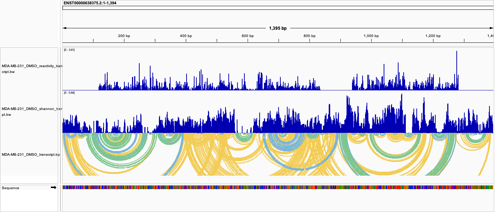

**Reactivity in genome coordinates** (`norm/genome_bw/<group>_reactivity_genome.bw`). Signal follows the exon structure of the gene model, with introns appearing as gaps; the genome view is meaningful for reactivity because it is a per-nucleotide measurement:

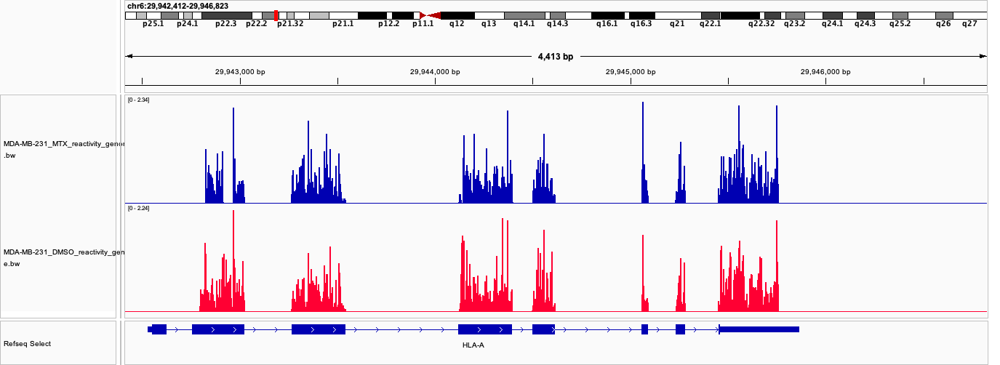

For **structure**, the genome view is less useful at a multi-isoform locus like HLA-A. In the base-pair arc tracks, each arc connects two paired bases, coloured by base-pair probability: **yellow** = 10-40%, **blue** = 40-70%, **green** = 70-100% (pairs below 10% are not drawn; `rf-fold`'s dot-plot conversion runs with `--min-color-index 1`).

Genome-coordinate base-pair arcs (`fold/genome_bp/<group>_genome.bp`): base pairs from every folded isoform are projected onto the assembly and overlap into a dense tangle:

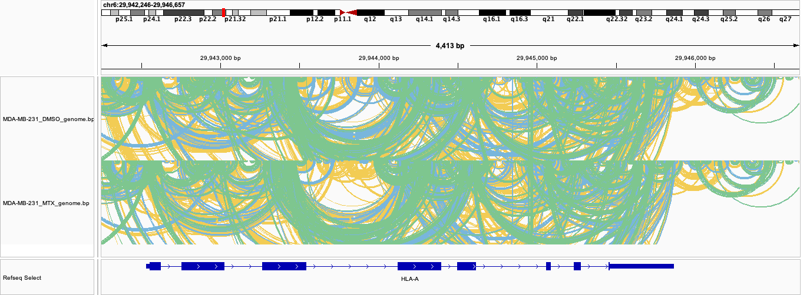

Transcript-coordinate base-pair arcs (`fold/transcript_bp/<group>_transcript.bp`): the same data for one transcript, showing clean nested arcs:

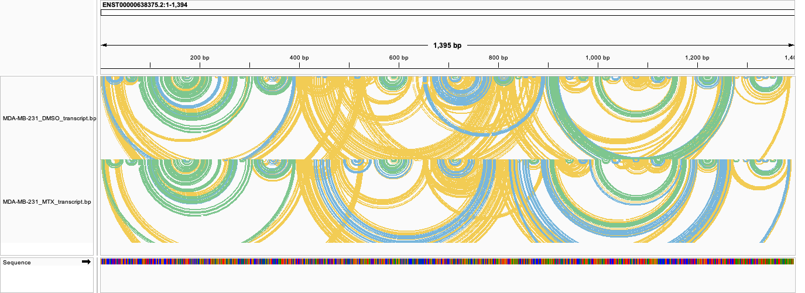

The Shannon-entropy tracks (`fold/shannon_{genome,transcript}_bw/`) behave the same way: clean per transcript, superposed in genome coordinates.

### rf-structextract (optional)

<details markdown="1">
<summary>Output files</summary>

- `fold/<group>/extracted_structures/dotbracket/*.db`: Extracted structural motifs for the sample group in dot-bracket notation (one multi-record file per transcript, each record named `<transcript>_<start>-<end>`), filtered to high-confidence, low-reactivity / low-Shannon elements meeting the configured criteria.
- `fold/<group>/extracted_structures/images/*_ss.svg`: One 2D diagram per extracted motif, drawn with ViennaRNA RNAplot and coloured by SHAPE reactivity in the same style as the rf-fold structure plots.

</details>

[`rf-structextract`](https://rnaframework-docs.readthedocs.io/en/latest/rf-structextract/) extracts well-defined structural elements from the rf-fold output by combining the predicted structures with per-base reactivity and Shannon entropy. Only runs when `--structextract` is set (see [usage docs](usage.md) for the selection-criteria parameters). It identifies substructures whose bases are consistently below the transcript median for both reactivity and Shannon entropy, which is the signature of stably folded regions.

#### Example extracted motif

This is where `rf-structextract` earns its place: it pulls the few genuinely well-defined structural elements out of a large transcript, where the full-length fold is mostly low-confidence and hard to read. The human transcript `ENST00000942651` (2,173 nt, `MDA-MB-231_DMSO` group) is a good example: its full rf-fold ViennaRNA diagram (`fold/MDA-MB-231_DMSO/structures/viennarna/ENST00000942651.svg`) is a dense, largely uninformative hairball:

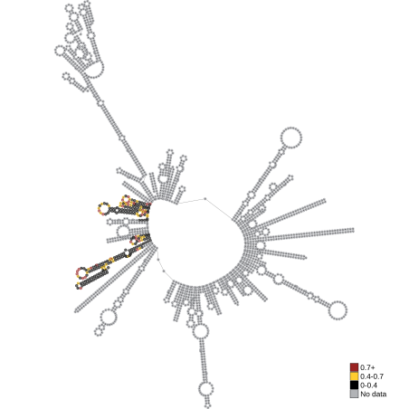

From this, `rf-structextract` isolates one region, positions 646-750, whose bases pass the reactivity and Shannon-entropy tests, a well-defined 105 nt motif that would otherwise be lost in the full-length diagram. It is written to the multi-record dot-bracket file (`extracted_structures/dotbracket/ENST00000942651.db`, record `ENST00000942651_646-750`) and drawn on its own, reactivity-coloured, in `extracted_structures/images/ENST00000942651_646-750_ss.svg`:

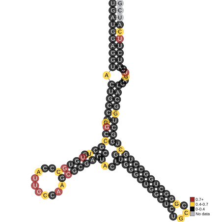

### rf-jackknife (optional)

<details markdown="1">
<summary>Output files</summary>

- `jackknife/all_groups_jackknife/` (the default pooled run; with `--rfjackknife_pool_all false` you instead get one `jackknife/<group>_jackknife/` per sample group)
  - `mFMI.csv`: Grid-search scores as a semicolon-delimited matrix. Rows are slope values, columns are intercept values, and each cell is the mean modified Fowlkes-Mallows Index (mFMI) between the reference structures and the structure rf-fold predicts at that slope/intercept.
  - `rfjackknife.log`: Raw `rf-jackknife` console output, including the ranked top slope/intercept pairs and the jackknifing statistics.

</details>

[`rf-jackknife`](https://rnaframework-docs.readthedocs.io/en/latest/rf-jackknife/) identifies optimal slope and intercept parameters for reactivity-guided structure folding by performing a grid search and comparing predicted structures to a set of reference structures using the (modified) Fowlkes-Mallows Index.

This step only runs when `--jackknife_reference` is provided.

#### Example `mFMI.csv` and log

Below is a bacterial calibration (`jackknife/all_groups_jackknife/`, DMS-MaP scored against two reference structures, 16S and 23S rRNA). Rows are slopes, columns are intercepts, and higher mFMI is better; the scores climb towards the high-slope, low-magnitude-intercept corner (columns abbreviated):

```text
mFMI;-3;-2.8;…;-1.6;-1.4;…;-0.2
0;0.483;0.484;…;0.567;0.573;…;0.654
2.2;0.691;0.734;…;0.810;0.820;…;0.840
4.4;0.817;0.819;…;0.859;0.867;…;0.826
4.8;0.818;0.831;…;0.867;0.859;…;0.829
```

`rf-jackknife` ranks the best pairs and reports how many transcripts contributed in the log:

```text
[+] Top slope/intercept value pairs:

  Slope    Intercept    mFMI

  4.4      -1.4         0.867
  4.8      -1.6         0.867
  4.6      -1.4         0.866
  4.6      -1.6         0.864
  3.4      -1.2         0.860

[+] Jackknifing statistics:

  [*] Used transcripts:     2
  [*] Excluded transcripts: 0 total
```

Here the optimal pair is slope `4.4` / intercept `-1.4` (mFMI `0.867`). mFMI runs from 0 to 1, where around `0.5` is no better than chance and higher means closer agreement with the reference structures; as a rough guide a best value above `0.7` indicates a genuinely well-calibrated fold, so `0.867` here is a strong result. When jackknife runs, these calibrated values take priority over the `--rffold_slope`/`--rffold_intercept` flags and the chemical-based defaults, and are passed on to rf-fold (unless `--stop_after_jackknife` is set).

### rf-eval (optional)

<details markdown="1">
<summary>Output files</summary>

- `eval/<group>_rfeval/`
  - `rfeval.log`: Raw `rf-eval` console output. The evaluation metrics (Unpaired Coefficient, DSCI, and AUROC) are reported here in the "Overall metrics" block; this log is currently the only published output of the step.

</details>

[`rf-eval`](https://rnaframework-docs.readthedocs.io/en/latest/rf-eval/) evaluates how well normalised reactivity profiles agree with a set of reference structures. It reports three metrics, each running from 0 to 1, where around `0.5` is chance-level (a reactivity profile with no relationship to the known structure) and higher means better agreement:

- **Unpaired Coefficient**: fraction of highly reactive bases that are unpaired
- **DSCI**: probability that a randomly selected unpaired base has higher reactivity than a paired base
- **AUROC**: area under the ROC curve treating reactivity as a classifier of unpaired bases

This step only runs when `--rfeval_reference` is provided.

#### Example metrics

Below is the "Overall metrics" block from `rfeval.log` for one of the bacterial _E. coli_ sample groups, evaluated against the reference 16S and 23S rRNA structures:

```text
[i] Successfully evaluated 1 structure(s)
[i] Overall metrics:

  [*] Coefficient unpaired: 0.816
  [*] DSCI:                 0.871
  [*] AUC:                  0.873
```

All three metrics sit at 0.82-0.87 here, comfortably above the ~0.5 chance level, so the DMS reactivities agree well with the reference rRNA structure.

## MultiQC

<details markdown="1">
<summary>Output files</summary>

- `multiqc/`
  - `multiqc_report.html`: MultiQC report aggregating QC metrics across all samples.

</details>

[MultiQC](http://multiqc.info) aggregates results from all pipeline tools into a single report. Alongside the standard modules (FastQC read quality, Cutadapt trimming, Bowtie/Bowtie2/STAR alignment rates, and SAMtools flagstat/idxstats/stats), the pipeline adds custom summary tables that follow the samples through the RNA Framework steps. The screenshots below are from the human dataset (MDA-MB-231, DMS-MaP).

#### General Statistics

The standard MultiQC table, aggregating key per-sample metrics (read counts, duplication, GC, trimming, and alignment rate) across the QC modules:

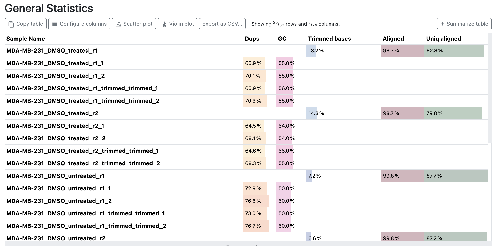

#### Count Progression

Per sample: reads mapped before and after deduplication, the fraction removed, and the number of transcripts `rf-count` covered. With the default `--skip_markdup true` (no UMIs) nothing is deduplicated, so "Removed by Dedup" is `0.0%`.

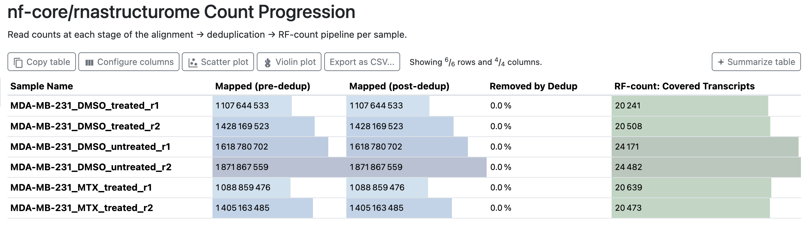

#### RF-norm Statistics

Per `sample_group` + replicate: how many of the covered transcripts pass `rf-norm`'s coverage filter ("Good Coverage"). The steep drop from ~20,000 covered transcripts to a few thousand well-covered ones is expected; only transcripts with enough per-base signal are worth normalising and folding.

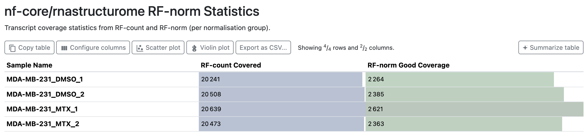

#### RF-fold Statistics

Per `sample_group`: transcripts folded by `rf-fold` versus those discarded (too short, or without enough reactivity coverage to fold).

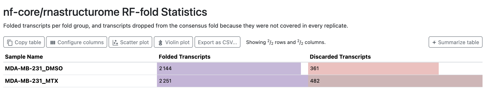

#### Replicate Correlation

Per `sample_group`: the replicate count and the mean pairwise Pearson and Spearman reactivity correlation, an at-a-glance reproducibility check. See [rf-correlate](#rf-correlate) for the per-replicate logs these are summarised from.

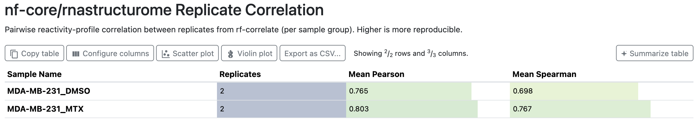

## Pipeline information

<details markdown="1">
<summary>Output files</summary>

- `pipeline_info/`
  - `execution_report_<timestamp>.html`: Nextflow execution report with per-process resource usage.
  - `execution_timeline_<timestamp>.html`: Timeline view of task execution.
  - `execution_trace_<timestamp>.txt`: Tab-separated trace file with runtime and resource metrics per task.
  - `pipeline_dag_<timestamp>.html`: Directed acyclic graph of the pipeline.
  - `params_<timestamp>.json`: Snapshot of all parameters used for the run.
  - `nf_core_rnastructurome_software_mqc_versions.yml`: Software versions for all tools used.

</details>

[Nextflow](https://www.nextflow.io/docs/latest/tracing.html) provides excellent functionality for generating various reports relevant to the running and execution of the pipeline. The files listed above are generated by default when the pipeline finishes. All files are timestamped so successive runs in the same output directory accumulate without overwriting prior results.
